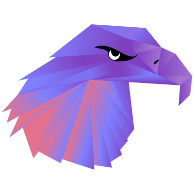

  

## 📌 About Me
- 🌱 Estudiante de Ingeniería en Tecnologías de la Información e Innovación Digital en la UTEZ.
- 💻 Enfocado en desarrollo de aplicaciones y creación de software funcional.
- 🧩 Me gusta convertir ideas en soluciones bien estructuradas y fáciles de usar.
- ☕ Trabajo con Java, JavaFX, FXML y Maven en mis proyectos.
- 🗄️ También estoy fortaleciendo mis bases de datos con MySQL y Oracle.
- 🌐 Estoy aprendiendo HTML, CSS y más herramientas para desarrollo web.
- 🐧 Me interesa Linux, la tecnología y seguir mejorando mis habilidades técnicas.
- 🚀 Siempre busco aprender cosas nuevas, mejorar la experiencia de usuario y escribir código más claro y ordenado.

## 📊 GitHub Stats & Trophies

  

  

## 🛠️ Languages & Tools

> ## Programming Languages

  
  
  
  

> ## Frontend

  
  
  

> ## Database

  
  
  
  

> ## DevOps & Cloud

  

> ## Tools

  
  
  
  
  

> ## Operating Systems & Terminal

  
  
  
  
  

  

## 🔗 Connect with Me

   

<picture>
  <source media="(prefers-color-scheme: dark)" srcset="https://raw.githubusercontent.com/abozanona/abozanona/output/pacman-contribution-graph-dark.svg">
  <source media="(prefers-color-scheme: light)" srcset="https://raw.githubusercontent.com/abozanona/abozanona/output/pacman-contribution-graph.svg">
  
</picture>

  

